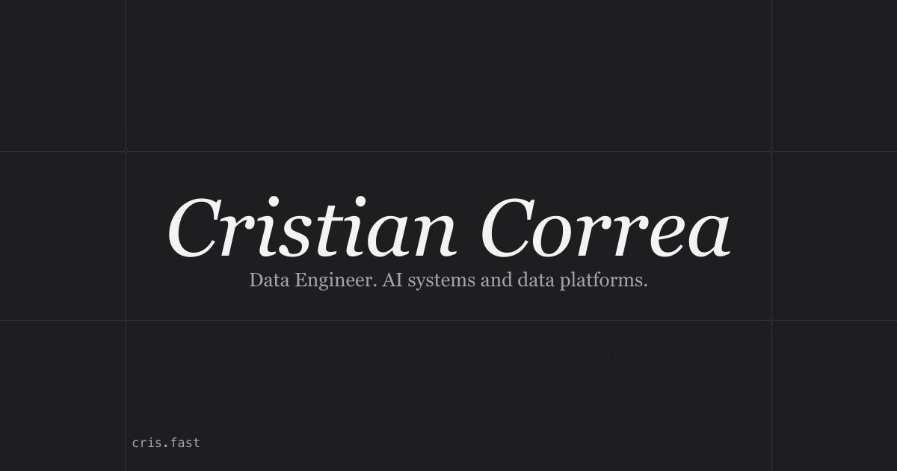

<div align="center">



# cris.fast

My portfolio, in two flavours: a quiet typographic site — and the same profile as a **real terminal**.

[**cris.fast**](https://cris.fast) &nbsp;·&nbsp; [**cris.fast/cli**](https://cris.fast/cli)

</div>

---

## Two ways in

**`/`** — a spare, serif, hairline-bordered page. Experience, projects, awards, and a GitHub contributions heatmap.

**`/cli`** — the whole thing as a shell you can actually type into. Not a fake prompt: it runs on [wterm](https://wterm.dev), a VT/xterm emulator written in Zig and compiled to WebAssembly, rendered to the DOM.

```
~$ help
~$ experience
~$ contributions
~$ open maca
```

Tab completion, `↑ ↓` history, `ctrl+a/e/u/k/w/l/c/d`, "did you mean" suggestions, and a contributions heatmap drawn with ANSI grayscale tiles. Try `neofetch`. There's an easter egg in `ls -a`.

## Make it yours

Every piece of profile content lives in one file:

```
lib/profile.ts     ← name, bio, experience, projects, awards, skills, socials
```

Both the GUI and the CLI read from it, so they can't drift apart. Fork, edit that file, swap the logos in `public/logos/`, and you have your own.

## Stack

Next.js 16 (App Router) · React 19 · TypeScript · Tailwind v4 · Bun · Vercel

Type is Instrument Serif + Geist Mono. Social cards for `/cli` are generated at build time with `next/og`. No CMS, no database — every page is prerendered, and the contributions panel revalidates hourly.

## Run it

```bash
bun install
bun dev
```

Then open [localhost:3000](http://localhost:3000).

```bash
bun run build        # production build
bunx tsc --noEmit    # typecheck
```

## Layout

```
app/
  page.tsx              landing
  cli/                  terminal page + dynamic OG card
components/
  terminal/             shell engine, ANSI helpers, heatmap renderer
  ui/gitmap.tsx         contributions heatmap (GUI)
lib/profile.ts          all profile content
```

The shell (`components/terminal/shell.ts`) is plain TypeScript with no framework imports — it talks to the page through a small `ShellHost` interface, so it can be driven headlessly in tests.

## One quirk worth knowing

Contributions come from a free community API that rate-limits by IP, and Vercel's shared egress addresses get throttled — so the server fetch can fail in production while working fine everywhere else. The panel handles it: it tries server-side first (logged, never swallowed), and falls back to fetching from the visitor's own browser. If you fork this, that's why the code looks the way it does.

---

<div align="center">
<sub>Built by <a href="https://cris.fast">Cristian Correa</a> · Bogotá, Colombia</sub>
</div>
